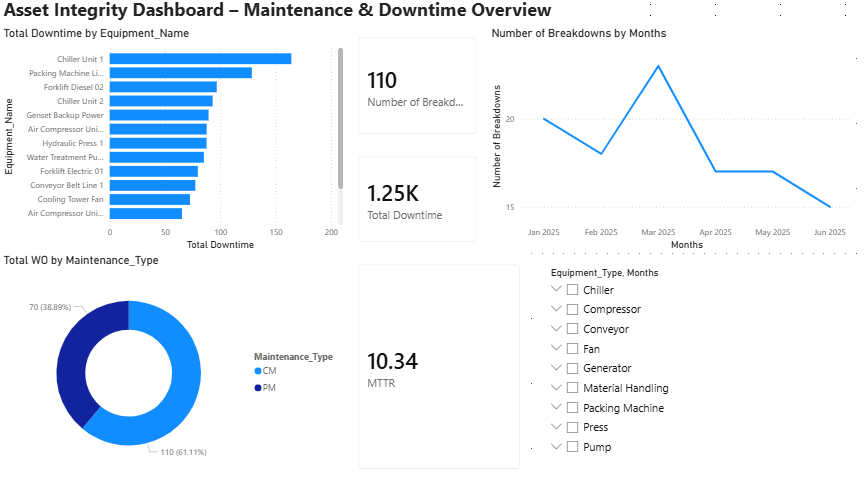
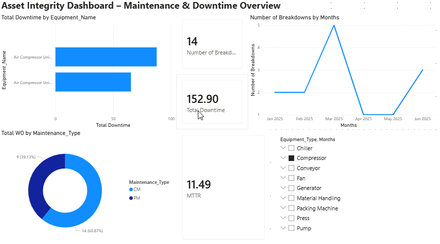

# Asset Integrity Dashboard – Maintenance & Downtime Overview

## 📌 Overview
Dashboard Power BI untuk memonitor performa maintenance pada 15 unit equipment
(compressor, chiller, conveyor, forklift, dll) selama periode Januari–Juni 2025.
Project ini dibuat untuk melatih skill data modeling, DAX, dan data storytelling
di bidang reliability & plant engineering.

## 🎯 Problem
Perusahaan manufaktur sering kesulitan memonitor tren downtime dan mengevaluasi
efektivitas strategi maintenance (Preventive vs Corrective) tanpa alat visualisasi
yang terpusat.

## 🛠️ Tools
- Power BI Desktop (Power Query, DAX, Data Modeling)
- Python (generate synthetic dataset)

## 📊 Dashboard Features
- KPI Card: Total Downtime, Number of Breakdowns, MTTR
- Bar chart: Total Downtime by Equipment
- Donut chart: PM vs CM ratio
- Line chart: Trend jumlah breakdown per bulan (sudah diurutkan kronologis Jan–Jun)
- Slicer interaktif: Equipment Type & Bulan

## 🔍 Key Insight
- Total 180 work order tercatat sepanjang Jan–Jun 2025, terdiri dari 110 Corrective
  Maintenance (CM) dan 70 Preventive Maintenance (PM).
- Porsi CM masih mendominasi (~61%) dibanding PM (~39%) — mengindikasikan strategi
  preventive maintenance perlu ditingkatkan untuk menekan unplanned downtime.
- Rata-rata MTTR (Mean Time To Repair) sebesar 10.34 jam per breakdown.
- Chiller Unit 1 tercatat sebagai equipment dengan total downtime tertinggi,
  menjadi kandidat prioritas untuk review preventive maintenance plan.
- Jumlah breakdown sempat memuncak di Maret 2025, menandakan perlu investigasi
  lebih lanjut terhadap penyebab lonjakan tersebut.

## 📁 Files
- `dataset/maintenance_downtime_data.csv` — data mentah (synthetic dataset)
- `power-bi/asset_integrity_dashboard.pbix` — file dashboard Power BI
- `screenshots/` — tampilan dashboard

## 🖼️ Preview

**Overview (tanpa filter)**

**Filter (Equipment Type: Compressor)**

## 👤 Author
Pujo Trihantoro | [LinkedIn](https://linkedin.com/in/trihantoro)
